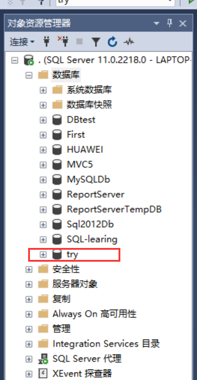
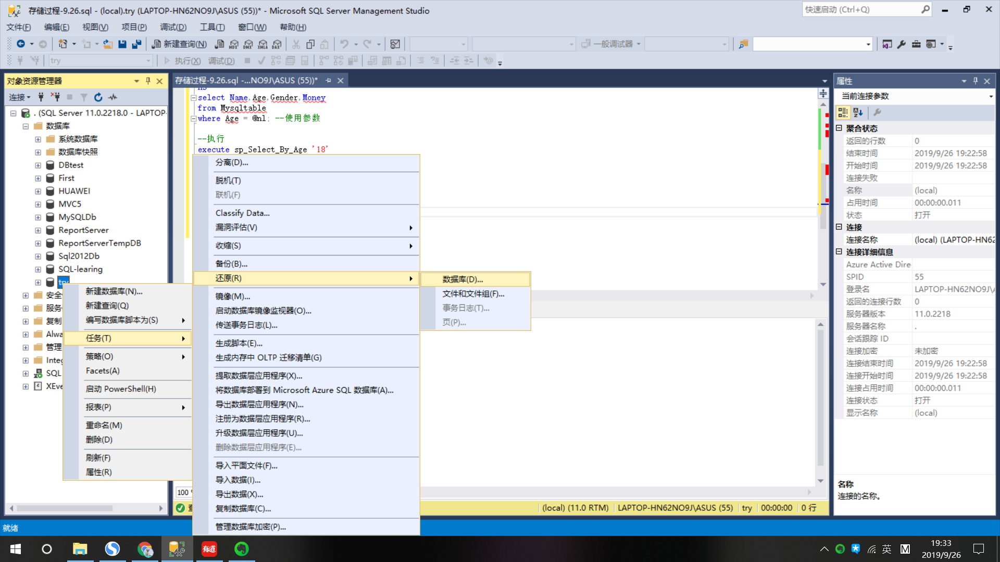
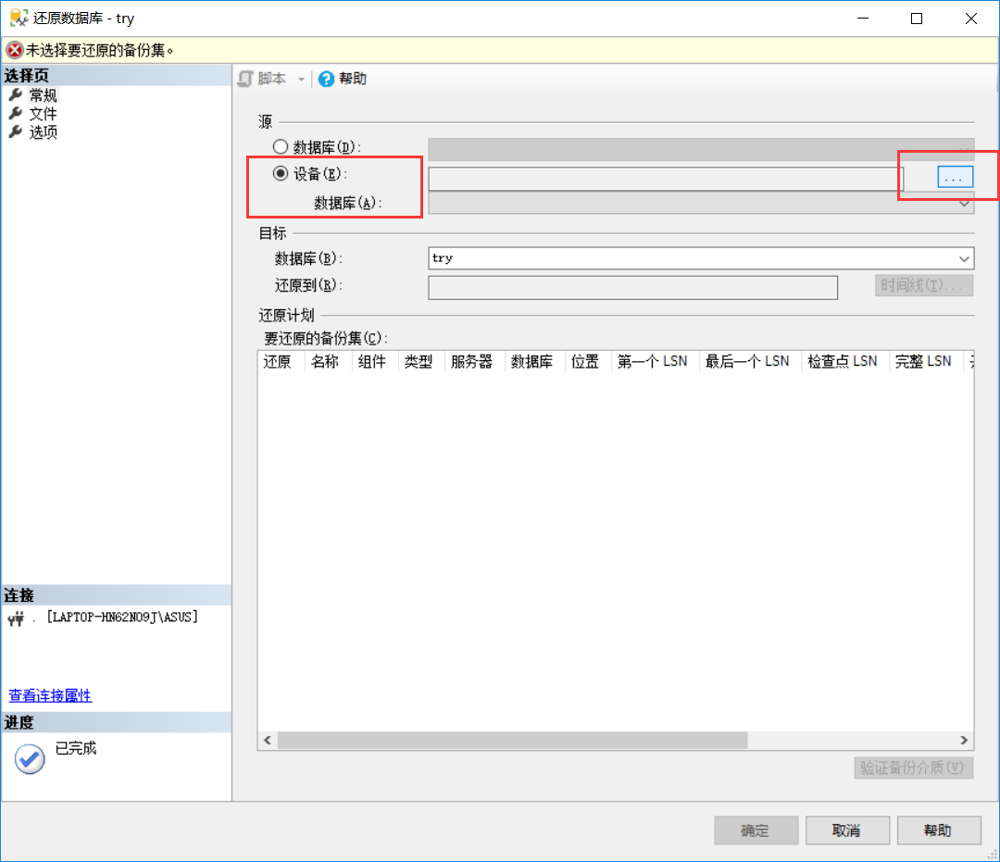
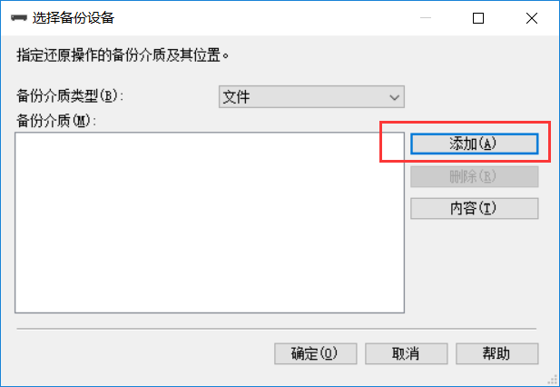
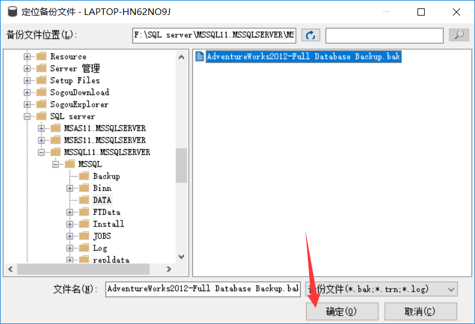
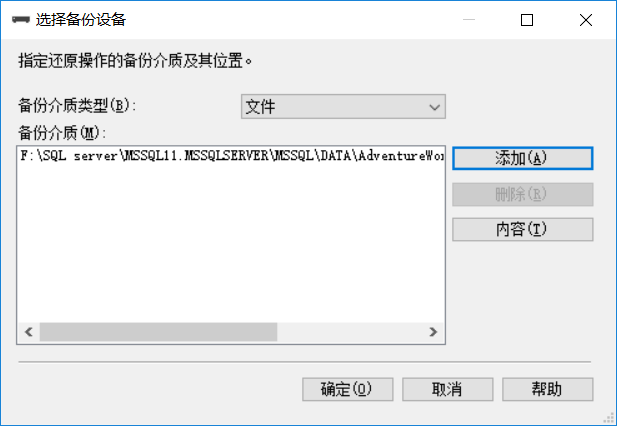
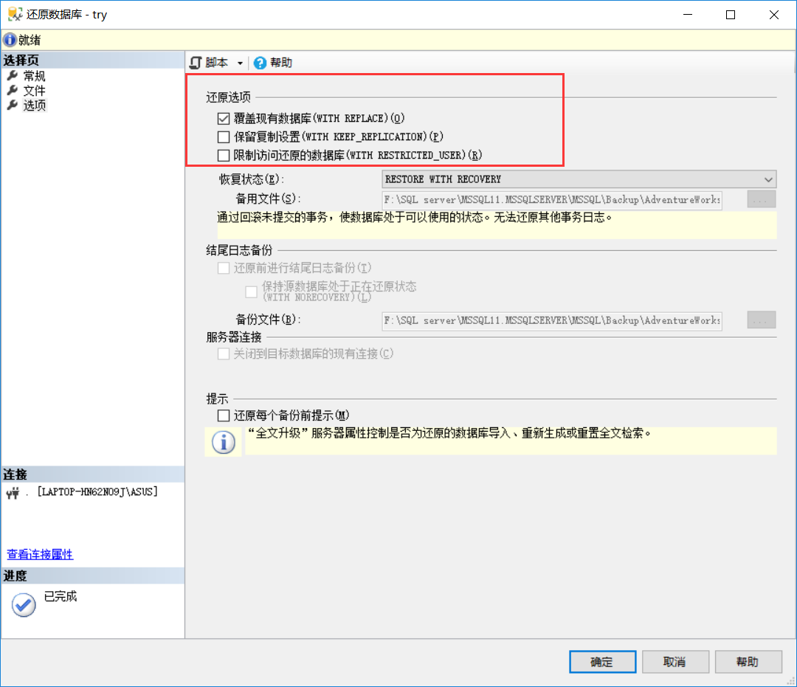

**`引入外部.bak文件`**

1. 创建一个新的数据库，或者使用一个已有的但不再使用的数据库。  我这里新建了一个名为`try`的数据库

2. 右键，新建的try数据库，任务->还原->数据库

3. 点击设备->扩展按钮

	
  
4. 点击添加

5. 这一步非常关键，但更关键的任务在前面，步骤：找到存放数据库文件的地址->一次打开->打开DATA文件夹（这个文件夹下面就是数据库文件和日志）

点击确定

确定后可以看到，备份文件(.bak文件)已经被添加到被选框

6. 最后一步，这一步取决于.bak文件来自于外部（在这里外部是指，这个.bak文件不是由try数据库生成的），还是内部（由try数据库生成）。如果是来自内部就不用进行下面的操作，外部则需要进行下面的操作:

选中覆盖现有数据库，这样才能成功将外部.bak问件导入，最后，导入成功会提示导入成功
